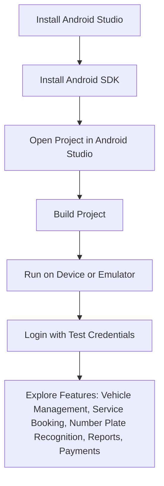

# Electronic Vehicle Maintenance System (eVMS)

## Overview

eVMS (Electronic Vehicle Maintenance System) is an Android application designed to streamline vehicle maintenance operations for organizations and individuals. The app supports multiple user roles (Admin, Manager, Employee, Customer) and provides features for vehicle management, service booking, employee/manager administration, reporting, payments, and advanced number plate recognition using OCR.

---

## Table of Contents
- [Features](#features)
- [Technologies Used](#technologies-used)
- [System Requirements](#system-requirements)
- [Setting up the Development Environment](#setting-up-the-development-environment)
- [Usage](#usage)
- [Number Plate Recognition Feature](#number-plate-recognition-feature)
- [Notes](#notes)
- [License](#license)
- [Acknowledgments](#acknowledgments)

---

## Features

- **Multi-role Login:** Separate login for Admin, Manager, Employee, and Customer.
- **Vehicle Management:** Add, view, and manage vehicles.
- **Service Management:** Add, update, remove, and purchase maintenance services.
- **Number Plate Recognition:** Capture vehicle number plates using the camera, extract text using OCR, and auto-fill vehicle details.
- **Employee & Manager Management:** Appoint, remove, and manage employees and managers.
- **Reporting:** Generate sales, employee, and manager reports.
- **Gatepass Generation:** Create and display gate passes for vehicles.
- **Notifications:** Customer notification panel for updates and alerts.
- **Payment Processing:** Integrated modules for processing and making payments.
- **Firebase Integration:** Uses Firestore for data storage and Firebase Storage for images.

---

## Technologies Used
- Java (Android)
- Android SDK
- Firebase (Firestore, Storage)
- Google Mobile Vision (TextRecognizer)
- uCrop (Image cropping)
- Picasso (Image loading)
- Material Design Components

---

## System Requirements

- **Android Studio** (latest version recommended)
- **Android SDK tools**
- **Java Development Kit (JDK) 8 or higher**
- **Minimum Android Version:** 9.0 (API level 28)
- **Active Internet Connection** (for Firebase and cloud features)

---

## Setting up the Development Environment

1. **Download and Install Android Studio**
   - Visit [Android Studio Download](https://developer.android.com/studio) and download the latest version.
   - Follow the installation instructions for your OS.
2. **Install Android SDK**
   - Open Android Studio and complete the setup wizard to install the required SDKs.
3. **Open the Project**
   - Launch Android Studio.
   - Select **Open an Existing Project** and navigate to the project folder.
   - Click **OK** to load the project.

---

## Usage

### Building and Running
- In Android Studio, select **Build > Make Project** to compile and resolve dependencies.
- Fix any build errors (ensure all dependencies in `build.gradle` are available).

### Running on a Real Device
- Enable USB debugging (Settings > About phone > Tap Build number 7 times > Developer options > Enable USB debugging).
- Connect your device via USB.
- In device settings, search for **USB configuration** and set it to **File Transfer**.
- Select your device in Android Studio and click **Run**.

### Running on an Emulator
- Set up an Android Virtual Device (AVD) in Android Studio.
- Click **Run** to launch the app on the emulator.

### Setup & Usage Flow

---

## Number Plate Recognition Feature

eVMS includes a built-in number plate recognition system:
- Employees can capture a vehicle's number plate using the device camera.
- The app uses Google Mobile Vision's `TextRecognizer` to extract text from the image.
- Extracted text is processed with regex to match standard number plate formats (e.g., ABC-1234).
- Common OCR errors (like 'O' for '0') are auto-corrected.
- The recognized plate is used to auto-fill vehicle details or validate entries.

---

## Notes
- Ensure you have the latest Android Studio and SDK updates.
- The app requires Android 9.0 (API 28) or higher.
- Use a device with an active internet connection for full functionality.
- For best experience, use dark theme on your phone.

---

## Acknowledgments

This project was developed as part of an academic software engineering course at FAST-NUCES under the supervision of **Dr. Ali Afzal Malik**.

**Team Members:**
- Ahmad Wyne  
- Abdur Rehman  
- Hassan Yousaf  
- Ibrahim Gul  
- Muhammad Ibrahim (me)

We worked collaboratively, dividing responsibilities across features and UI/UX modules, and tackled technical challenges like OCR and Firebase integration together.

---

## License
This project is for educational purposes only. For production use, ensure compliance with all third-party library licenses.
